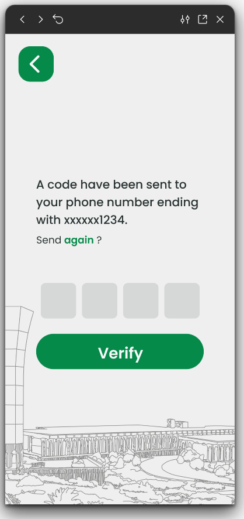
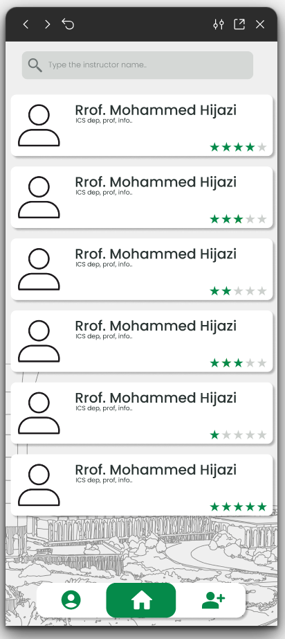
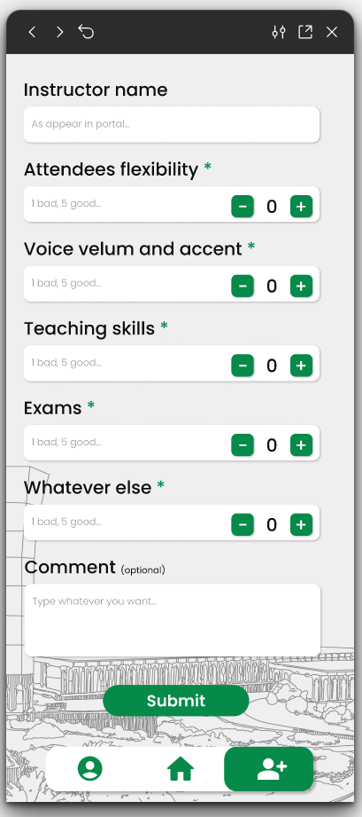

# KFUPMEval
A Flutter app for crowd-sourced instructor feedback powered by Firebase Phone Auth and Realtime Database.

<table>
  <tr>
    <td></td>
    <td></td>
    <td></td>
    <td></td>
  </tr>
</table>

## Features
- Phone-number login (Firebase Phone Auth with +966 format) and OTP verification.
- Persisted login phone number (SharedPreferences) to scope edits to the user’s own feedback.
- Browse instructors with search and aggregated averages across four categories.
- View per-instructor details and comments.
- Add new instructor feedback (ratings + optional comment).
- Edit your own submitted feedback entries.

## Tech Stack
- Flutter 3 / Dart 3
- Firebase: Auth (phone), Realtime Database
- shared_preferences for local storage
- Material UI components

## App Structure (key files)
- lib/main.dart — Initializes Firebase and boots the app.
- lib/login_page.dart / lib/otp_page.dart — Phone login + OTP flow; saves phone to SharedPreferences.
- lib/home_page.dart — Lists instructors, search, navigation shell.
- lib/instructor_details_page.dart — Ratings breakdown and comments list.
- lib/add_instructor_page.dart — Submit new instructor feedback.
- lib/edit_instructor_page.dart, lib/EditInstructorDetailsPage.dart, lib/EditFeedbackPage.dart — Manage feedback you submitted.

### Realtime Database shape
```
instructors/
  {instructorName}/
    name: string
    feedbacks: [
      {
        phone_number: string,
        attendees_flexibility: int,
        voice_volume_accent: int,
        teaching_skills: int,
        exams: int,
        comment: string
      },
      ...
    ]
```

## Prerequisites
- Flutter SDK installed and on PATH (flutter --version).
- Chrome installed (default web target).
- Firebase project with:
  - A Web app configured and Phone Auth enabled.
  - Realtime Database created (in test or locked-down mode as you prefer).
  - Your web app config copied into FirebaseOptions in lib/main.dart (replace the placeholder values with your own).

> Tip: consider moving Firebase config to the FlutterFire-generated firebase_options.dart flow for safer environments.

## Setup
1) Enable web support (once):
```bash
flutter config --enable-web
```

2) Install dependencies:
```bash
flutter pub get
```

3) (Optional but recommended) Tighten Realtime Database rules so only authenticated users can write:
```json
{
  "rules": {
    ".read": true,
    ".write": "auth != null"
  }
}
```
Adjust to your privacy needs.

## Run (Web)
- Dev server in Chrome:
```bash
flutter run -d chrome
```
- If Chrome isn’t detected:
```bash
flutter run -d web-server --web-hostname localhost --web-port 8080
# then open the printed URL in your browser
```

## Build (Web)
```bash
flutter build web
# Output: build/web/ (serve with any static file host)
```

## Testing
```bash
flutter test
```

## Assets
- Background image used on login: assets/images/ (declared in pubspec.yaml).

## Notes & Caveats
- Phone numbers are validated as 10 digits and prefixed with +966; adjust validation for other regions if needed.
- Editing is scoped to feedback entries associated with the signed-in phone number.
- Realtime Database paths are currently keyed by instructor name; avoid duplicate names or switch to stable IDs if collisions are a concern.
